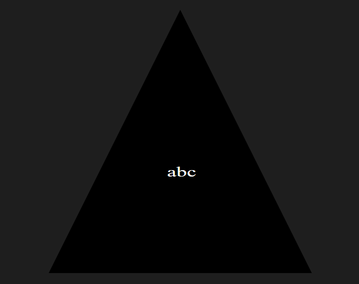

# SVG Generator

## Description

This program is supposed to generate basic svg's based on user input. Users have the option of creating circles, squares, and triangles specifically. Users are also able to put a maximum of 3 letters in the shape and specify what colors they want for the text and shape.

## Table of Contents

1. [Installation](#Installation)
2. [Usage](#Usage)
3. [License](#License)
4. [Contributing](#Contributing)
5. [Tests](#Tests)
6. [Questions](#Questions)

## Installation

You need to install node ver. 16.0.0 and the latest version of npm. You may also need to run "npm i" in the repo folder to install dependencies.

## Usage

First, you go to your terminal and change your directory to the repo folder. Then you type "node index.js" to run the code. You will be given 4 prompts that ask about the colors, text and shape of the desired svg. The text should be no greater than 3 characters. Color can be specified either by name or by hex code (e.g. #000000). Once everything is properly set up, a svg should appear under "assets" with a name that is generated based on your parameters.

## License

None

## Contributing

Corbin Spence

## Tests

To test this program, type "npm test" to run basic tests on the code.

## ScreenShot

## Video Demo

[Demo link](https://drive.google.com/file/d/1jAIvZ8BJCXax01dyI1c3gILDerRnE8zL/view)

## Questions

Github: [profile](https://github.com/CorbinSpence)

Email: corbinspence16@gmail.com
